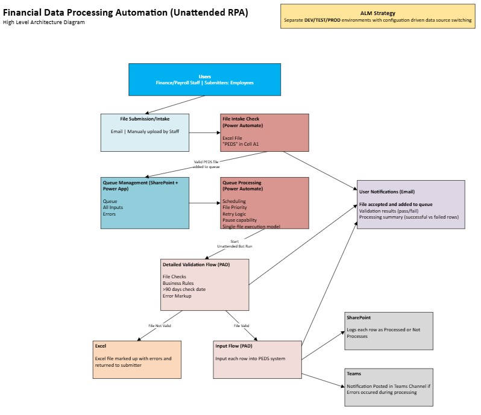
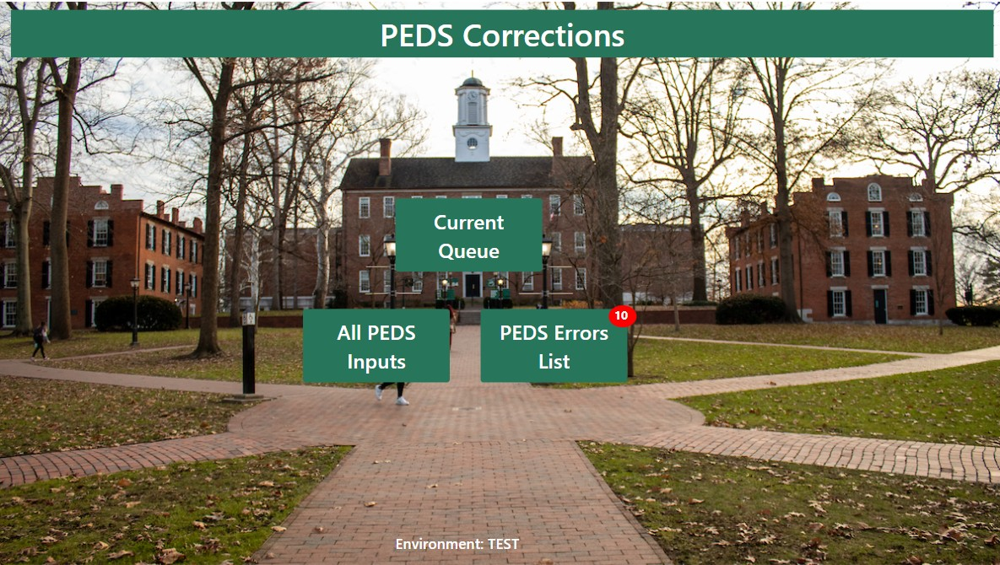
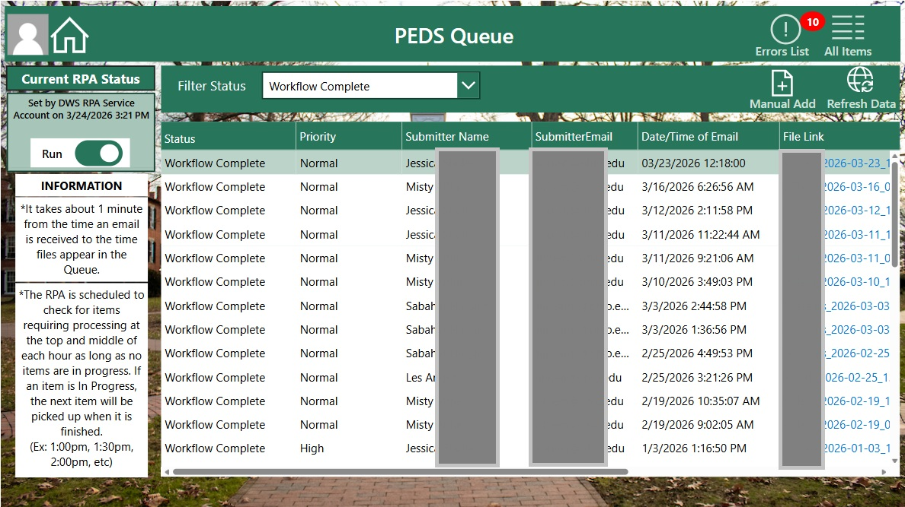
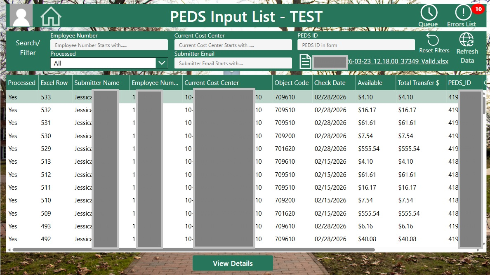
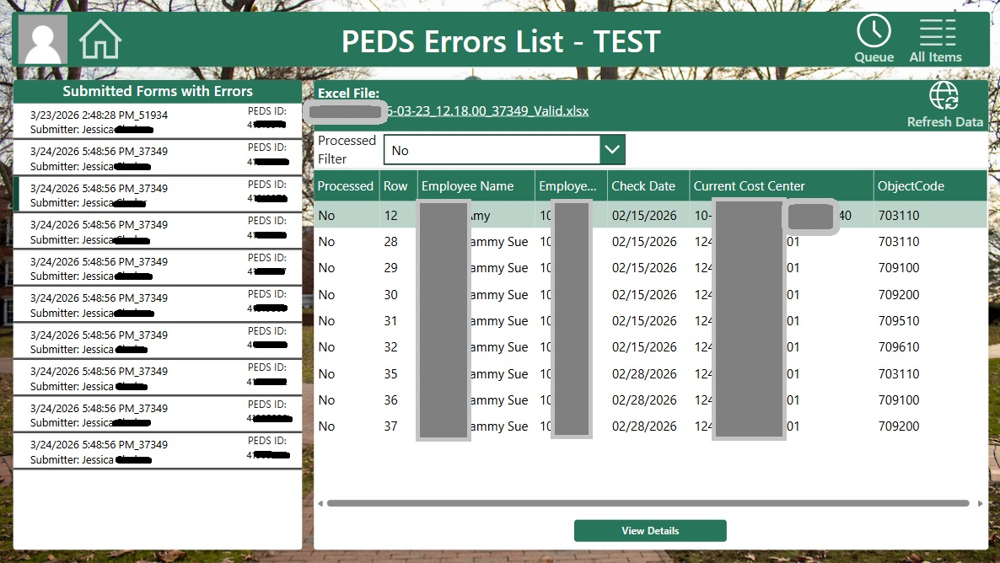
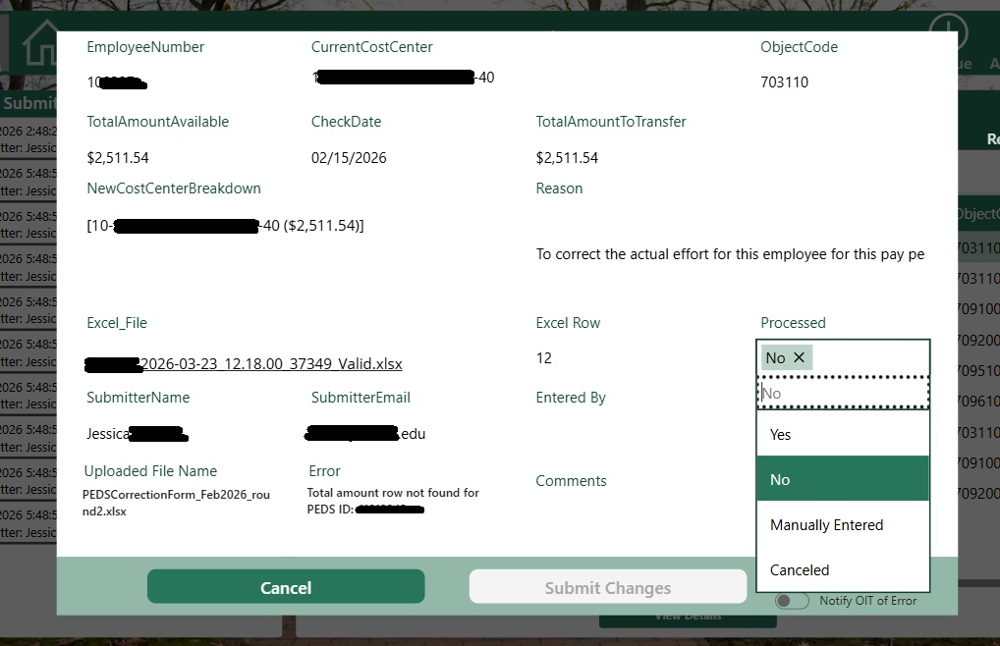

# PEDS Financial Data Processing Automation (RPA)
Queue-Based Robotic Process Automation for Financial Data Validation and Entry  

---

## Problem

The PEDS process supports internal financial adjustments between accounting structures and required staff to manually validate and enter correction data into a web-based system. Each submission could contain hundreds of rows, often with repeated account and date combinations that required identical validation checks.

The process was highly manual and time-consuming, requiring staff to repeatedly navigate a web interface to validate data and submit corrections. As submission volume increased, this created bottlenecks, delays, and increased risk of inconsistencies or errors.

In addition to the operational burden, there was no centralized mechanism to track submissions from intake through completion. Staff had limited visibility into which files were in progress, failed validation, or were partially processed, making it difficult to prioritize work, troubleshoot issues, or ensure timely completion.

---

## Solution

To address these challenges, I designed and implemented a queue-based RPA architecture using Power Automate, Power Automate Desktop (PAD), SharePoint, and a PowerApp interface. The solution separates intake, orchestration, validation, execution, and monitoring into distinct layers, enabling scalable and controlled automation.

The process begins with file submission via email or manual upload. A lightweight intake check confirms that the file is a valid Excel document and contains the expected PEDS identifier before allowing it to enter the processing queue. Once accepted, files are added to a centralized SharePoint-based queue where they are managed and prioritized.

A scheduled orchestration flow retrieves queue items and triggers an unattended Power Automate Desktop bot running on a virtual machine. At this stage, detailed validation is performed, including file structure checks, business rule validation, and enforcement of date constraints. Files that fail validation are marked directly within the Excel file and returned to the submitter for correction.

If validation succeeds, the automation proceeds to submit each row into the PEDS web system. Processing results are logged and tracked, and the system provides notifications throughout the lifecycle to keep users informed of submission status.

---

## Impact

The solution replaced a manual, fragmented process with a structured automation platform that significantly reduced processing time and improved consistency across submissions.

By introducing a centralized queue and orchestration layer, staff gained real-time visibility into the lifecycle of each file, from intake through validation and final processing. This enabled better prioritization of urgent work, faster troubleshooting of failures, and more predictable turnaround times.

The architecture also improved resilience by separating intake, validation, and execution. Invalid files are intercepted before processing, and failures can be retried without duplicating work, ensuring that issues do not block overall progress.

The system was designed to handle high-volume correction files at scale while also providing insight into performance. In one representative run, the automation evaluated 998 Excel rows containing 756 requested corrections. Runtime tracking showed that most processing time occurs during the web-based input phase, while validation completes more efficiently. The average runtime per requested correction is approximately 45 seconds, including both validation and system entry.

These metrics not only demonstrate throughput but also highlight the effectiveness of the validation layer in filtering out invalid or non-processable corrections before they reach the downstream system.

In addition, automated notifications at key stages—file acceptance, validation results, and final processing summary—provide clear feedback to submitters and reduce the need for manual follow-up.

---

## End-to-End Process Flow

### 1. File Submission and Intake
- Files are submitted via email or manual upload  
- Intake check confirms:
  - Excel format  
  - “PEDS” identifier in cell A1  

### 2. Queue Management
- Valid files added to SharePoint queue  
- Stores inputs, status, errors  

### 3. Orchestration (Power Automate)
- Scheduled processing  
- Priority handling  
- Retry logic  
- Pause capability  

### 4. Detailed Validation (PAD)
- File structure validation  
- Business rule checks  
- 90-day check date validation  
- Error markup  

### 5. Data Entry (PAD)
- Valid files submitted into PEDS system  
- Row-level processing  

### 6. Monitoring and Outputs
- SharePoint logs (row status)  
- Teams alerts for errors  
- Email notifications  

---

## User Notification Lifecycle

- File accepted and added to queue  
- Validation results (pass/fail)  
- Processing summary (successful vs failed rows)  

### High Level Diagram 

---

## Key Design Decisions

### Unattended RPA Execution
Runs on VM using unattended PAD for reliable processing.

### Queue-Based Processing Model
- Single file execution  
- Priority handling  
- Safe retries  

### Separation of Intake and Execution
Prevents duplicate processing and enables scheduling control.

### Post-Queue Validation
Detailed validation ensures only valid data is processed.

### Deduplication Optimization
Reduces repeated validation checks for performance.

### Error Handling and Retry
Failures logged and reprocessable without duplication.

### Human-in-the-Loop
PowerApp enables monitoring, prioritization, and manual intervention.

---

## Architecture Overview

- Intake Layer  
- Queue Layer  
- Orchestration Layer  
- Execution Layer  
- Monitoring & Communication Layer  

---

### Power App Monitoring

Home Screen 

Current Queue - Files are added as they arrive. Statuses available: New, In Progress, Retry, Worfklow Failed, Workflow Complete 

All PEDS Input - Logs all rows attempeted to process in website with "Processed" either Yes or No. Includes excel link and row number for reference. 

PEDS Errors List - Allows staff to see all rows that were not successfully processed and allows them to view details to manually enter row, or cancel if error persists. Also included a toggle to inform IT of the error if they believe the error was due to a workflow issue. 

Details Screen for Manually Entry - Staff can make a selection for "Processed". This will log current users name and email for reference of who changed the Processed Status 

 

