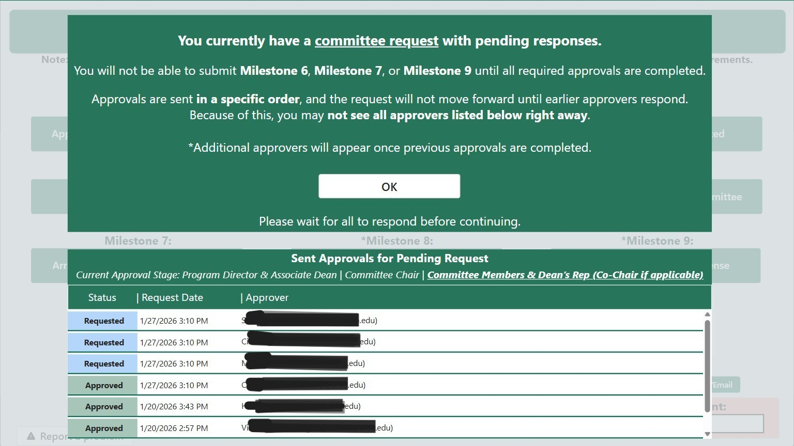
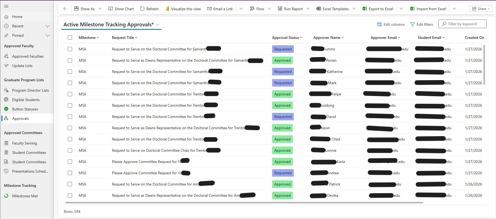

# Graduate College Milestone Tracking System  
A centralized Power Platform solution for managing graduate student milestones, approvals, and academic governance across multiple colleges.

---

## Problem

The Graduate College relied on a fragmented process to manage doctoral milestones, using email-based approvals, manual spreadsheets, and inconsistent workflows across colleges. This resulted in approval delays, inconsistent processes between programs, and limited visibility into student progress.

Because data was spread across multiple tools, staff did not have a reliable way to track where students were in the milestone process or identify those approaching completion. This made it difficult to anticipate graduation timelines or plan for advising, reviews, and administrative workload.

At the same time, the process required strict enforcement of academic policies, including multi-stage approvals, faculty eligibility rules, and role-based access. The existing approach could not consistently enforce these requirements and required significant manual coordination to maintain accuracy.

---

## Solution

I designed and implemented a centralized solution using Microsoft Power Platform, combining a Canvas App for user interaction, a Model-Driven App for administrative management, and Power Automate workflows to orchestrate approvals and data processing.

The system standardizes milestone submissions and approval routing across programs while enforcing business rules through configurable data structures. Role-based experiences guide students, faculty, and staff through the process, and automated workflows manage approvals, reminders, and data updates.

Milestone data is stored in Dataverse and synchronized to SharePoint to support reporting and downstream integration. This creates a consistent and reliable dataset that can be used to monitor student progression and support institutional reporting needs.

---

## Impact

The solution established a single, standardized platform for managing doctoral milestones, reducing manual coordination and improving consistency across programs. Automated approvals and dependency enforcement streamlined the process for both students and staff.

Centralizing milestone data also enabled new analytical capabilities. Staff can now track student progression across milestones, identify patterns, and anticipate upcoming graduation activity, improving planning for advising and administrative workload.

The platform was designed for long-term sustainability, with configurable business rules, structured DEV/TEST/PROD environments, and integration with downstream processes that update official student records in Oracle.

---

## Key Challenges and How They Were Solved

**Complex workflow requirements**  
Designed dynamic approval routing logic to support multiple workflow paths.

**Licensing constraints**  
Implemented parent/child flow patterns to securely access Dataverse without requiring premium licenses for all users.

**Data performance and accessibility**  
Introduced a hybrid Dataverse and SharePoint model to balance performance and usability.

**Changing business rules**  
Built a configuration-driven system allowing updates without application changes.

---

## Architecture Overview

The solution is structured using a layered architecture that separates user experience, data management, and automation. This design improves scalability, simplifies maintenance, and allows each component to evolve independently while supporting the overall workflow.

---

### User Experience Layer

**Canvas App**
- Student submissions (Milestones 6, 7, 9)  
- Staff submissions (Milestones 1–5, 8)  
- Role-based user experience  
- Milestone tracking and approval visibility  

**Model-Driven App**
- Administrative data management  
- Governance configuration  
- Approval monitoring  

---

### Data Layer

**Dataverse (System of Record)**
- Milestones  
- Committees  
- Faculty eligibility  
- Program hierarchy  
- Approval tracking  

**SharePoint (Reporting Layer)**
- Nightly synchronized datasets  
- Optimized for performance and reporting  

---

### Automation Layer

- Multi-stage approval workflows  
- Reminder and timeout logic  
- CSV report generation and distribution  
- Nightly data synchronization (Milestones Complete & Student Committee Lists: Dataverse → SharePoint)  
- Weekly data synchronization (Eligible Students: Office 365 Security Group → Dataverse)  

### Architecture Overview

The solution is structured using a layered architecture that separates user interaction, orchestration, automation, and data storage to support scalability and maintainability.

  
   
  <em>High-level architecture showing separation of Canvas App, Model-Driven App, automation workflows, and data layers with DEV/TEST/PROD ALM strategy.</em>

---

## Role-Based Design

The system supports distinct user experiences based on role, ensuring each group interacts with the system in alignment with their responsibilities. Roles are determined using Dataverse tables (Eligible Students and Program List).

---

### Students

- Submit Milestones 6, 7, and 9  
- View milestone completion status  
- Track pending approvals and prevent submission when approvals are outstanding  

#### Student Experience

  
   
  <em>Home Screen – Student view with access to milestone submission forms.</em>

  
   
  <em>Milestones Completed – Displays completed milestones and progress tracking.</em>

  
   
  <em>Validation Popup – Prevents submission when required approvals are still pending.</em>

---

### College Staff

- Submit Milestones 1–5 and 8  
- View student progress and committee assignments  
- Access reporting and administrative views  

#### Staff Experience

  
   
  <em>Home Screen – Staff view with access to administrative forms and reporting tools.</em>

  
   
  <em>Committee List – Displays committee assignments for students in users college.</em>

  
   
  <em>Milestones Met – Provides visibility into student milestone completion for students in users college.</em>

### Student-Driven Approvals (Milestones 6, 7, 9)

The approval workflow is designed using a staged model, where approvals are grouped and processed in sequence while allowing parallel approvals within each stage.

**Approval Stages:**

1. **Program Director & Associate Dean (parallel approval stage)**  
2. **Committee Chair**  
3. **Committee Members & Dean’s Representative (parallel approval stage)**  

This structure ensures appropriate oversight while reducing delays by allowing multiple approvers to respond simultaneously within each stage.

---

#### Approval Request Example (Committee Chair)

  
   
  <em>Approval request email clearly outlining committee structure, program details, and required response deadline.</em>

---

#### Approval Reminder Example

  
   
  <em>Automated reminder email including deadline and direct navigation link to the approval record within the correct environment.</em>

### Staff-Driven Approvals (Milestones 4, 5, 8)

- Submitted by staff  
- Routed through defined approval chains to ensure oversight  

### Dependency Enforcement

The system enforces milestone sequencing to maintain process integrity. For example, students cannot submit Milestone 7 or Milestone 9 until Milestone 6 has been fully approved, as later milestones depend on an approved committee structure.

---

## Governance and Data Management (Model-Driven App)

A Model-Driven App provides a centralized interface for managing system data, business rules, and administrative processes. This allows staff to control system behavior through configuration rather than requiring application updates.

### Approved Faculty

The Model-Driven App manages faculty eligibility and enforces governance rules for committee selection.

  
   
  <em>Approved Faculty Management – Administrative interface for maintaining faculty eligibility levels.</em>

Faculty eligibility is controlled through defined levels:

- **Level 2:** Eligible to serve as Chair or Member  
- **Level 1:** Eligible to serve as Member only  
- **Level 0:** Not eligible and excluded from selection  

This ensures that committee assignments comply with academic policies and prevents students from selecting ineligible faculty.

---

#### Data Retrieval Logic (Canvas App)

The Canvas App dynamically retrieves eligible faculty using a Power Fx collection populated from Dataverse via a parent/child flow pattern. This approach enables secure data access and centralizes data retrieval logic without requiring direct connections from the app.

  
   
  <em>Power Fx Collection – Retrieves and structures approved faculty data for use in selection controls.</em>

---

#### Filtered Faculty Selection (Level-Based)

Faculty selection controls are filtered based on eligibility level to enforce role-specific requirements.

  
   
  <em>Filtered Selection – Only Level 2 faculty are available for Chair selection based on eligibility rules.</em>

---

### Program Director List

Stores Program Directors, Associate Deans, and Program Coordinators.  

Used for:
- Approval routing  
- Dropdown selection choices in Canvas App
- Role-based access control in Canvas App

---

### Button Statuses

Controls whether milestone forms are available for submission.  

This allows staff to enable or pause submissions without modifying the application.

---

### Approval Tracking

A custom approval tracking layer extends native approval functionality by providing centralized visibility into approval activity and progress.

This layer enables:

- Centralized tracking of approval status and history  
- Real-time visibility into pending approvals  
- Integration of approval status directly within the Canvas App  

  
   
  <em>Approval Tracking – Custom interface displaying approval status, history, and pending actions within the application.</em>

---

### Faculty Serving

Provides visibility into faculty workload by allowing staff to select a faculty member and view all committees they are currently serving on.

  
   
  <em>Faculty Serving – Custom page displaying all committee assignments for a selected faculty member to support workload visibility and planning.</em>

---

### Student Committees

Two views are provided:
- A display view as Custom Page  
- An administrative view for managing records in Dataverse  

This separation ensures both usability and data control.

---

### Milestones Met

Tracks all completed milestones for each student, including completion dates.  

Supports reporting, dashboards, and data exports.

---

## Reporting Strategy

A nightly automation process synchronizes data from Dataverse to SharePoint to create a reporting layer optimized for performance and accessibility.

Staff can:
- View aggregated data directly in the application  
- Receive CSV reports via email  

---

## Key Design Decisions

### Configuration-Driven Architecture

Business rules are controlled through Dataverse tables, allowing changes to be made without modifying the application.

This includes:
- Faculty eligibility rules  
- Submission availability  
- Approval routing logic  

---

### Performance Optimization

SharePoint is used as a reporting layer to reduce direct load on Dataverse and improve application responsiveness.

---

### Security and Access Strategy

- Role-based user experience and data access  
- Controlled exposure of data  
- Service account-driven workflows for reliability and continuity  

---

### Environment Strategy (DEV / TEST / PROD)

The solution was designed using a structured application lifecycle management (ALM) approach with separate Development, Test, and Production environments. This ensured that new features, configuration changes, and workflow updates could be developed and validated without impacting live users.

Environment-specific configuration was handled dynamically using environment variables and conditional logic within the application. For example, data sources such as SharePoint lists and Dataverse tables were selected at runtime based on the current environment, allowing the same application and workflows to operate across DEV, TEST, and PROD without requiring manual changes.

### ALM and Environment Configuration

This approach enabled:

- Controlled testing and validation before production releases  
- Reduced risk of introducing errors into live workflows  
- Consistent deployment across environments using solution-based ALM practices  
- Improved maintainability by centralizing environment configuration logic  

  
   
  <em>Environment Configuration Logic – Uses environment-based switching to dynamically reference DEV, TEST, and PROD data sources.</em>

