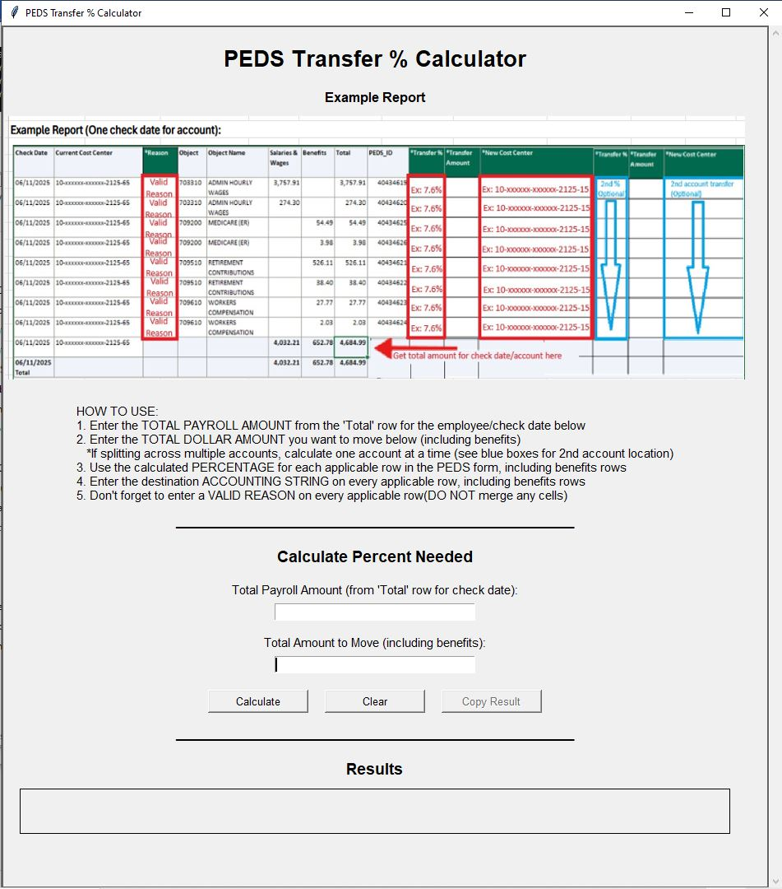
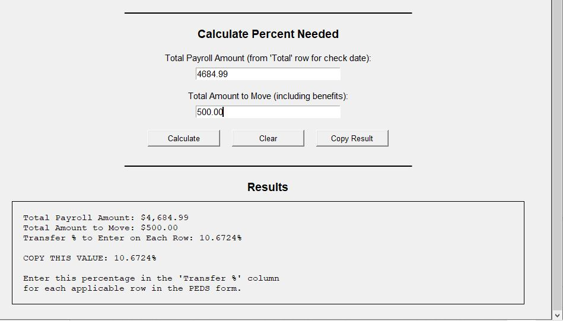

# PEDS Financial Data Processing Automation (RPA)
Queue-Based Robotic Process Automation for Financial Data Validation and Entry  

---

## Problem

The PEDS process supports internal financial adjustments between accounting structures and required staff to manually validate and enter correction data into a web-based system. Each submission could contain hundreds of rows, often with repeated account and date combinations that required identical validation checks.

This created a highly manual and time-intensive workflow, where staff were required to repeatedly navigate the system to validate data and submit corrections. As submission volume increased, the process became a bottleneck, introducing delays, increasing the likelihood of inconsistencies, and limiting the team’s ability to scale.

At the same time, the process lacked a centralized mechanism to track submissions from intake through completion. Staff had limited visibility into processing status, failures, or partial completion, making it difficult to prioritize work, identify issues, or ensure timely processing.

---

## Solution

To address these challenges, I designed and implemented a queue-based RPA architecture using Power Automate, Power Automate Desktop (PAD), SharePoint, and a PowerApp interface. The solution separates intake, orchestration, validation, execution, and monitoring into distinct layers, creating a scalable and controlled automation framework.

The process begins with file submission via email or manual upload, followed by a lightweight intake check to confirm that the file is a valid Excel document containing the expected PEDS identifier. Files that pass this screening are added to a centralized SharePoint-based queue, where they are managed, tracked, and prioritized.

To improve data consistency before entering the validation pipeline, a supporting calculation tool was introduced to standardize how users determine transfer percentages required for PEDS submissions. This ensures that key financial inputs are calculated consistently prior to automated validation and processing.

A scheduled orchestration flow retrieves queue items and triggers an unattended Power Automate Desktop bot running on a virtual machine. Detailed validation is performed at this stage, including file structure checks, business rule enforcement, and date validation. Files that fail validation are marked directly within the Excel file and returned to the submitter for correction, preventing invalid data from entering downstream processing.

Validated files proceed to automated data entry, where each row is submitted into the PEDS system in a controlled execution model. Processing results are logged, and notifications are generated throughout the lifecycle to provide visibility into file acceptance, validation outcomes, and final processing results.

---

## Impact

The solution replaced a manual, fragmented process with a structured automation platform that significantly reduced processing time and improved consistency across submissions.

By introducing both a centralized queue and a standardized pre-processing approach, staff gained real-time visibility into the lifecycle of each file—from intake through validation and final processing. This enabled better prioritization of urgent work, faster troubleshooting of failures, and more predictable turnaround times.

A key improvement was the introduction of a supporting calculation tool to standardize transfer percentage inputs prior to submission. By removing variability in how users calculated percentages, the system reduced upstream data inconsistencies and improved the overall quality of data entering the validation and automation pipeline. This resulted in fewer validation failures and reduced the need for rework.

The architecture also improved resilience by separating intake, validation, and execution. Invalid files are intercepted before processing, and failures can be retried without duplicating work, ensuring that issues do not block overall progress.

The system was designed to handle high-volume correction files at scale while also providing insight into performance. In one representative run, the automation evaluated 998 Excel rows containing 756 requested corrections. Runtime tracking showed that most processing time occurs during the web-based input phase, while validation completes more efficiently. The average runtime per requested correction is approximately 45 seconds, including both validation and system entry.

These metrics not only demonstrate throughput but also highlight the effectiveness of the validation layer—combined with standardized user inputs—in filtering out invalid or non-processable corrections before they reach the downstream system.

In addition, automated notifications at key stages—file acceptance, validation results, and final processing summary—provide clear feedback to submitters and reduce the need for manual follow-up.

This combination of automation, validation controls, standardized inputs, and performance visibility transformed a manual, error-prone workflow into a scalable and measurable processing system.

---

## End-to-End Process Flow

### 1. File Submission and Intake
- Files are submitted via email or manual upload  
- Intake check confirms:
  - Excel format  
  - “PEDS” identifier in cell A1  

### 2. Queue Management
- Valid files added to SharePoint queue  
- Stores inputs, status, errors  

### 3. Orchestration (Power Automate)
- Scheduled processing  
- Priority handling  
- Retry logic  
- Pause capability  

### 4. Detailed Validation (PAD)
- File structure validation  
- Business rule checks  
- 90-day check date validation  
- Error markup  

### 5. Data Entry (PAD)
- Valid files submitted into PEDS system  
- Row-level processing  

### 6. Monitoring and Outputs
- SharePoint logs (row status)  
- Teams alerts for errors  
- Email notifications  

---

## User Notification Lifecycle

- File accepted and added to queue  
- Validation results (pass/fail)  
- Processing summary (successful vs failed rows)  

### High Level Diagram 

   
  <em>High-level architecture diagram</em>

---

## Key Design Decisions

### Unattended RPA Execution
- Runs on VM using unattended PAD for reliable processing.

### Queue-Based Processing Model
- Single file execution  
- Priority handling  
- Safe retries  

### Separation of Intake and Execution
- Prevents duplicate processing and enables scheduling control.

### Post-Queue Validation
- Detailed validation ensures only valid data is processed.

### Deduplication Optimization
- Reduces repeated validation checks for performance.

### Error Handling and Retry
- Failures logged and reprocessable without duplication.

### Human-in-the-Loop
- PowerApp enables monitoring, prioritization, and manual intervention.

---

## Supporting Tool: Transfer % Calculator

To further reduce upstream data inconsistencies and improve validation accuracy, I developed a lightweight desktop application using Python to standardize the calculation of transfer percentages required for PEDS submissions.

The calculator provides a guided interface that aligns with the structure of the PEDS report, allowing users to:

- Enter the total payroll amount from the report’s **“Total” row**  
- Enter the total dollar amount to be moved (including benefits)  
- Automatically calculate the correct transfer percentage  
- Copy the result directly into the PEDS form  

The application includes built-in input validation, user guidance, and a visual reference of the source report to ensure consistent and accurate data entry.

By standardizing this calculation step, the tool reduces manual errors and ensures that data entering the validation and automation pipeline is consistent, improving overall processing reliability and reducing downstream correction cycles.

  
   
  <em>Transfer % Calculator – Provides visual of example form.</em>

  
   
  <em>Transfer % Calculator – Standardizes calculation of required percentage prior to submission.</em>

---

## Architecture Overview

- Intake Layer  
- Queue Layer  
- Orchestration Layer  
- Execution Layer  
- Monitoring & Communication Layer  

---

### Monitoring Dashboard

The Power App provides a centralized interface for tracking file processing, reviewing errors, and supporting manual intervention when needed.

---

  
   
  <em>Home Screen – Entry point for navigating queue, processed items, and error tracking.</em>

  
   
  <em>Current Queue – Files are added as they arrive with statuses including New, In Progress, Retry, Workflow Failed, and Complete.</em>

  
   
  <em>All PEDS Input – Logs all processed rows with status (Yes/No), including Excel reference and row details.</em>

  
   
  <em>Error List – Displays failed rows with options to review, manually process, or escalate issues to IT.</em>

  
   
  <em>Details Screen – Supports manual status updates while capturing user identity for audit tracking.</em>

 

