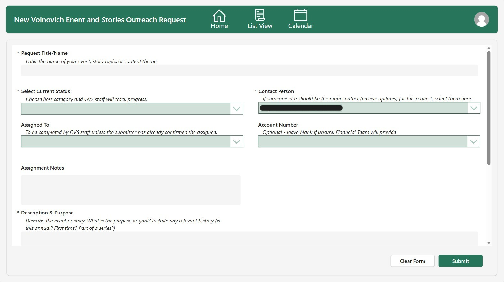

# Event & Outreach Request Management System

Centralized request management solution supporting event coordination, storytelling, and outreach workflows.

---

## Overview

This solution was designed to streamline how event and outreach requests are submitted, tracked, and managed across teams. It provides a user-friendly interface for submitters while giving staff and administrators the tools needed to manage assignments, track progress, and enforce governance.

The system leverages SharePoint as the data source, Power Apps for the user interface, and Power Automate for access control and automation.

---

## Key Capabilities

- Centralized request intake for events, news stories, and social media content  
- Role-based access control for administrators, staff, and viewers  
- Admin-managed configuration of dropdown values and system behavior  
- Dynamic form experience based on user selections  
- Validation framework to ensure complete and accurate submissions  
- Multiple views for managing requests (List View and Calendar View)  
- Environment-based testing with controlled access simulation  

---

## Key Design Decisions

- Admin-driven configuration eliminates dependency on developers  
- SharePoint provides scalable and structured data storage  
- Role-based UI enforces proper access and governance  
- Dynamic form logic improves usability and reduces complexity  
- Automated access control ensures consistency and reduces manual effort  
- Environment-based role simulation enables safe testing before production  

---

## Impact

- Improved visibility into event and outreach requests  
- Reduced manual coordination and communication overhead  
- Enabled scalable request management across teams  
- Increased data quality through enforced validation  
- Simplified maintenance through admin-driven design  
- Reduced deployment risk through structured ALM practices
  
---

## Architecture

### Data Layer
- SharePoint Lists  
  - Request tracking and metadata  
  - User access configuration  
  - Dropdown/choice value management  

### Application Layer
- Power Apps Canvas App  
  - Home screen navigation (List View, Calendar View, New Request)  
  - Admin screens for access and configuration  
  - Role-based UI and functionality  

### Automation Layer
- Power Automate flows  
  - User access provisioning (Add/Remove from SharePoint groups)  
  - Synchronization of access levels with SharePoint permissions  

---

## High Level Screens

   
  <em>Home Screen – Navigation entry point with role-based experience and TEST access simulation controls.</em>

  

   
  <em>Admin Access Management – Controls user roles and drives SharePoint permission assignment via automation.</em>

  

   
  <em>Admin Choice Values – Centralized management of dropdown values used throughout the application.</em>

  

   
  <em>List View – Filterable and sortable interface with role-based visibility and assignment tracking.</em>

  

   
  <em>Calendar View – Color-coded visualization of requests by date and category.</em>

---

## ALM & Environment Strategy

The solution follows a structured **DEV / TEST / PROD deployment model** using solution-based ALM practices.

### Key Features

- Separate environments for development, testing, and production  
- Configuration-driven behavior aligned with environment context  
- Controlled promotion of changes through each stage  

### Test Environment Behavior

The TEST environment includes a **role simulation feature**:

- Users with Admin access can select different access levels (Admin, Viewer, Assigned, None)  
- This allows validation of:
  - Role-based UI behavior  
  - Data visibility rules  
  - Form restrictions and permissions  

### “None” Access Behavior

Users not included in the access list are treated as **No Access users**:

- Can submit new requests  
- Can view only:
  - Requests where they are the submitter  
  - Requests where they are the contact person  

List View is dynamically filtered based on:
- Assigned access level  
- Or absence of access  

---

## Role-Based Design

The application enforces role-based experiences driven by an **Admin Access List**.

### Admin
- Full access to all screens and data  
- Ability to edit requests and manage users  
- Access to Admin configuration screens  

### Viewer
- Read-only access to List and Calendar views  
- Cannot edit or manage data  

### Assigned
- Can view items assigned to them  
- Limited visibility based on assignment logic  

### Default Users (Not in Access List)
- Can submit new requests  
- Can only view requests where they are the submitter or contact  

---

## Admin-Driven Configuration

Administrators can manage dropdown values directly within the app, including:

- Assigned To  
- Assigned Photographer  
- Current Status  

Changes made in the admin interface automatically propagate throughout:
- New request forms  
- Edit forms  
- List and filtering experiences  

This eliminates the need for developer involvement when updating system values.

---

## Access Control Automation

Access levels are managed through a SharePoint-backed configuration list and enforced using Power Automate.

### Automation Behavior

- When a user is added or updated:
  - Added to either:
    - SharePoint Edit Group  
    - SharePoint Read-Only Group  

- When a user is removed:
  - Automatically removed from corresponding SharePoint groups  

---

## Dynamic Form Experience

The request form adapts based on user selections using toggle-driven logic.

   
  <em>Dynamic Form – Sections expand based on user selections (event, photography, news, social media).</em>

  

   
  <em>Conditional Logic – Toggles dynamically control visibility of additional required fields.</em>

---

## Validation & Submission Logic

The form enforces required data through a structured validation framework.

   
  <em>Validation Framework – Missing fields highlighted with submission blocked until complete.</em>

### Features

- Required fields dynamically validated before submission  
- Missing fields visually highlighted in red  
- Submission button disabled until all required data is complete  
- Warning banner displayed at the top of the form  

---

## Views & User Experience

### List View
- Filterable and sortable request list  
- Inline status indicators  
- Assignment visibility  
- Toggle-based quick insights  
- Dynamically filtered based on access level  

### Calendar View
- Requests displayed by date  
- Color-coded categories  
- Visual scheduling overview  
