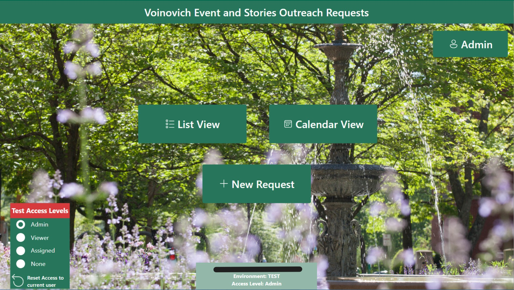
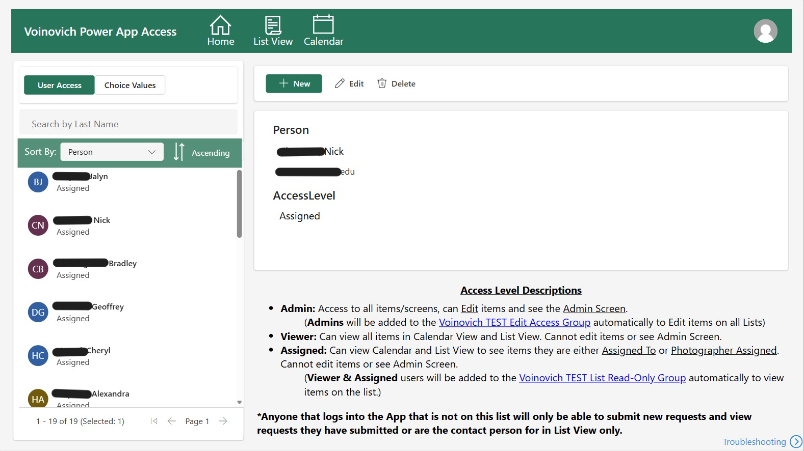
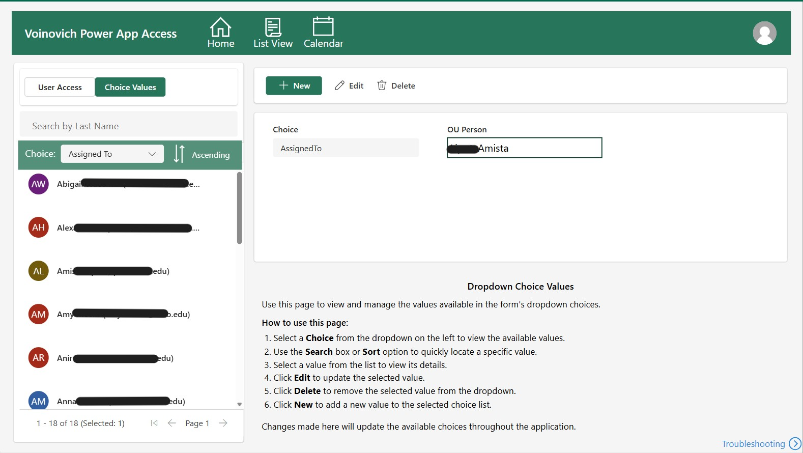
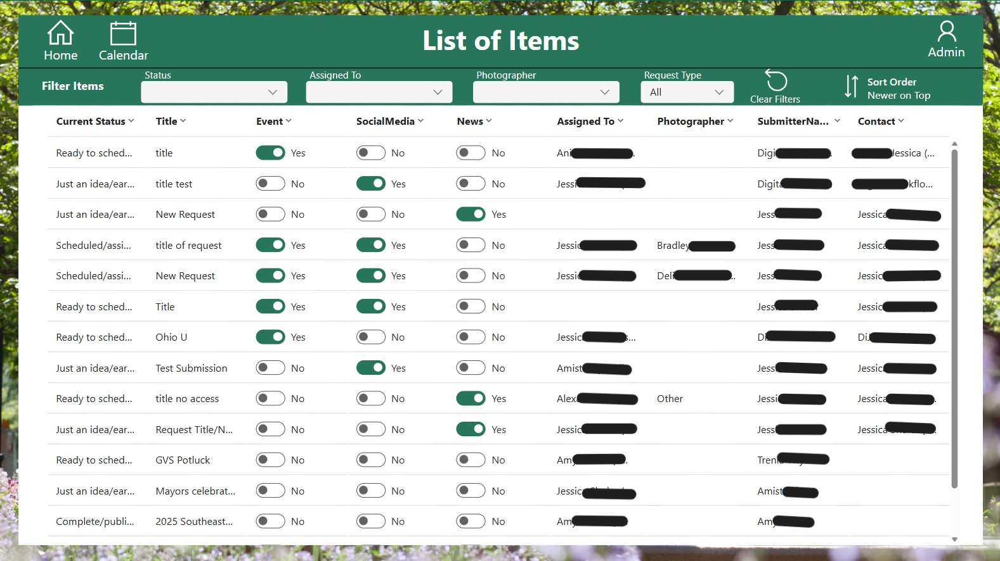
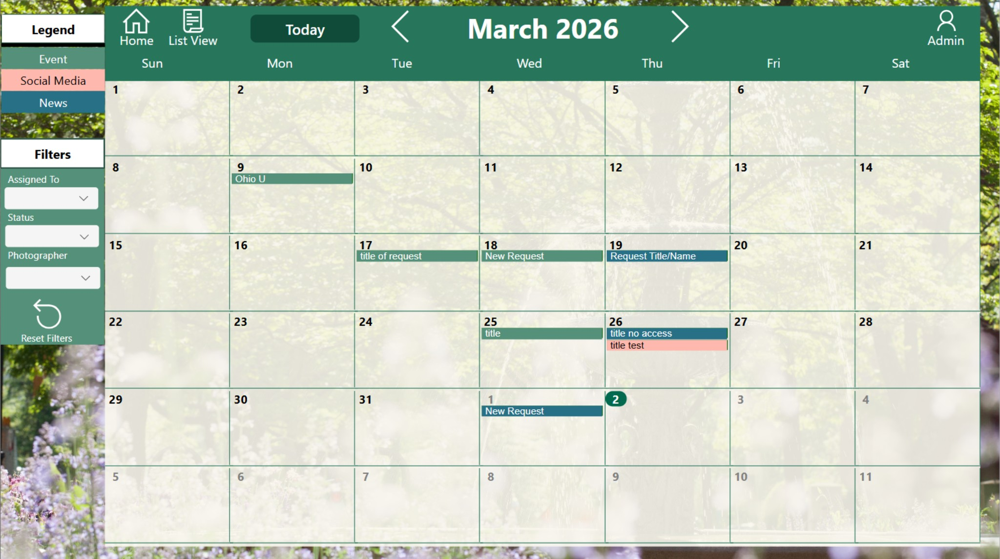
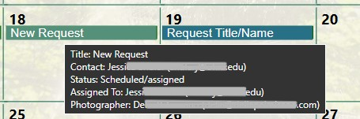
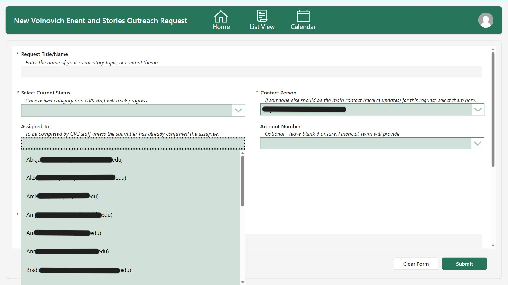
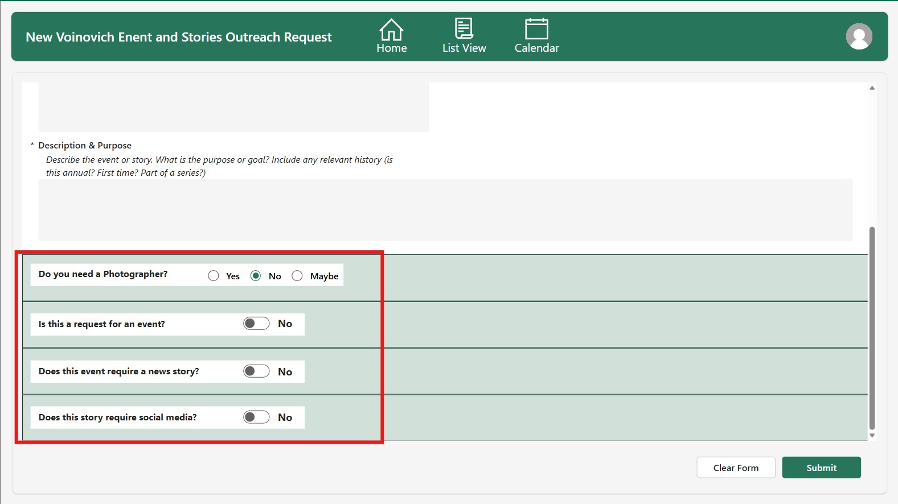
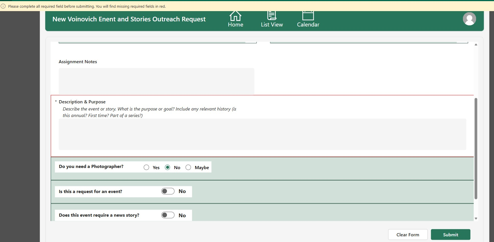

# Event & Outreach Request Management System

Centralized request management solution supporting event coordination, storytelling, and outreach workflows.

---

## Problem

Event and outreach requests were managed through informal processes, resulting in inconsistent data capture, limited visibility into request status, and manual coordination between staff. Requests for events, news stories, and social media were handled differently across teams, making it difficult to standardize workflows or track assignments.

A key gap was the lack of a centralized calendar view to display all events and due dates. Staff had no efficient way to visualize upcoming work or understand workload across the team, making it difficult to plan and prioritize requests.

---

## Solution

I designed and implemented a centralized request management solution using Microsoft Power Platform, combining a Canvas App, SharePoint lists, and Power Automate.

The application standardizes request intake using dynamic, toggle-driven forms that adapt based on request type (event, news, social media). An admin-driven configuration model allows dropdown values such as assignment, photographer, and status to be managed without code changes.

Role-based access is enforced through a SharePoint-backed configuration list and automated with Power Automate, ensuring users are placed into the correct permission groups. A calendar view provides a centralized, color-coded visualization of requests by date and category.

The solution also follows a DEV/TEST/PROD model, including a test environment with role simulation to validate access scenarios before release.

---

## Impact

The solution created a centralized and standardized platform for managing requests, improving visibility and reducing manual coordination.

The introduction of a calendar view enabled staff to better plan and track upcoming work, while role-based access and automation reduced administrative overhead. Dynamic forms and validation logic improved data quality, and the admin-driven design simplified ongoing maintenance.

---

## Key Challenges and How They Were Solved

**Lack of centralized visibility and scheduling**  
Introduced a calendar view to provide a clear overview of events and deadlines.

**Inconsistent request intake**  
Built dynamic forms that adapt to different request types while enforcing required data.

**Manual access management**  
Automated SharePoint permissions based on role assignments.

**Ongoing maintenance of system values**  
Implemented an admin-driven configuration model to allow updates without application changes.

---

## Key Design Decisions

- Implemented an admin-driven configuration model to allow system updates without application changes  
- Used SharePoint as the primary data source to balance structure, accessibility, and rapid development  
- Enforced role-based access through both UI logic and automated SharePoint permissions  
- Introduced a test environment with role simulation to validate access behavior before production release  

---

## Architecture

### Data Layer
- SharePoint Lists  
  - Request tracking and metadata  
  - User access configuration  
  - Dropdown/choice value management  

### Application Layer
- Power Apps Canvas App  
  - Home screen navigation (List View, Calendar View, New Request)  
  - Admin screens for access and configuration  
  - Role-based UI and functionality  

### Automation Layer
- Power Automate flows  
  - User access provisioning (Add/Remove from SharePoint groups)  
  - Synchronization of access levels with SharePoint permissions  

---

## High Level Screens

   
  <em>Home Screen – Navigation entry point with role-based experience and TEST access simulation controls.</em>

  

   
  <em>Admin Access Management – Controls user roles and drives SharePoint permission assignment via automation.</em>

  

   
  <em>Admin Choice Values – Centralized management of dropdown values used throughout the application.</em>

  

   
  <em>List View – Filterable and sortable interface with role-based visibility and assignment tracking.</em>

  

   
  <em>Calendar View – Color-coded visualization of requests by date and category.</em>

  

   
  <em>Calendar View – Tooltip shows more details for item for a quick glance.</em>

---

## ALM & Environment Strategy

The solution follows a structured **DEV / TEST / PROD deployment model** using solution-based ALM practices.

### Key Features

- Separate environments for development, testing, and production  
- Configuration-driven behavior aligned with environment context  
- Controlled promotion of changes through each stage  

### Test Environment Behavior

The TEST environment includes a **role simulation feature**:

- Users with Admin access can select different access levels (Admin, Viewer, Assigned, None)  
- This allows validation of:
  - Role-based UI behavior  
  - Data visibility rules  
  - Form restrictions and permissions  

### “None” Access Behavior

Users not included in the access list are treated as **No Access users**:

- Can submit new requests  
- Can view only:
  - Requests where they are the submitter  
  - Requests where they are the contact person  

List View is dynamically filtered based on:
- Assigned access level  
- Or absence of access  

---

## Role-Based Design

The application enforces role-based experiences driven by an **Admin Access List**.

### Admin
- Full access to all screens and data  
- Ability to edit requests and manage users  
- Access to Admin configuration screens  

### Viewer
- Read-only access to List and Calendar views  
- Cannot edit or manage data  

### Assigned
- Can view items assigned to them  
- Limited visibility based on assignment logic  

### Default Users (Not in Access List)
- Can submit new requests  
- Can only view requests where they are the submitter or contact  

---

## Admin-Driven Configuration

Administrators can manage dropdown values directly within the app, including:

- Assigned To  
- Assigned Photographer  
- Current Status  

Changes made in the admin interface automatically propagate throughout:
- New request forms  
- Edit forms  
- List and filtering experiences  

This eliminates the need for developer involvement when updating system values.

---

## Access Control Automation

Access levels are managed through a SharePoint-backed configuration list and enforced using Power Automate.

### Automation Behavior

- When a user is added or updated:
  - Added to either:
    - SharePoint Edit Group  
    - SharePoint Read-Only Group  

- When a user is removed:
  - Automatically removed from corresponding SharePoint groups  

---

## Dynamic Form Experience

The request form adapts based on user selections using choice/toggle-driven logic.

   
  <em>Dynamic Form – Combo Box choices driven from Choice Values in Admin Screen (Current Status, Assigned To).</em>

  

   
  <em>Conditional Logic – Toggles dynamically control visibility of additional required fields.</em>

---

## Validation & Submission Logic

The form enforces required data through a structured validation framework.

   
  <em>Validation Framework – Missing fields highlighted with submission blocked until complete.</em>

### Features

- Required fields dynamically validated before submission  
- Missing fields visually highlighted in red  
- Submission button disabled until all required data is complete  
- Warning banner displayed at the top of the form  

---

## Views & User Experience

### List View
- Filterable and sortable request list  
- Inline status indicators  
- Assignment visibility  
- Toggle-based quick insights  
- Dynamically filtered based on access level  

### Calendar View
- Requests displayed by date  
- Color-coded categories  
- Visual scheduling overview  
